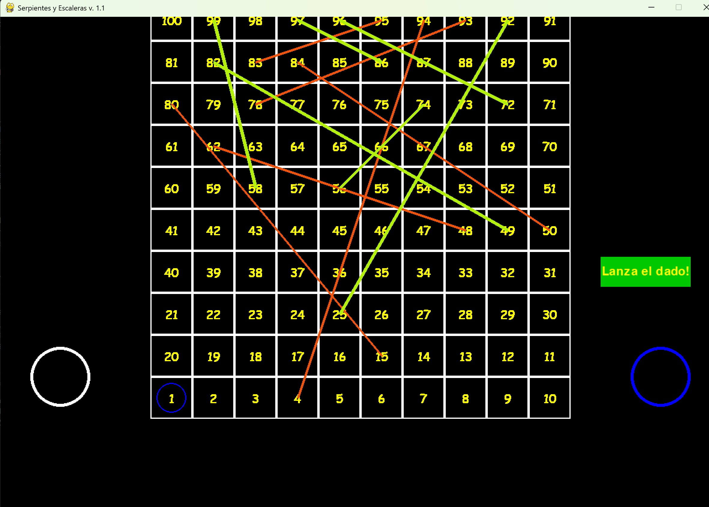

# Escaleras y Serpientes

Este proyecto fue desarrollado en 2018 como parte del curso **Introducción a las Ciencias de la Computación**. Es una implementación del clásico juego de mesa "Escaleras y Serpientes" utilizando Python.

## Requisitos

- Python 3.6 o superior
- Paquete `uv` instalado

## Instalación

Sigue estos pasos para instalar y ejecutar el proyecto:

1. Clona este repositorio:
    ```bash
    git clone https://github.com/rvmosquera/Escaleras-y-Serpientes.git
    cd Escaleras-y-Serpientes
    ```

2. Ejecuta el programa:
    ```bash
    uv run main.py
    ```

## Pruebas

Las pruebas se encuentran en la carpeta `pictures`. Aquí están los casos de prueba:

1. **Prueba 1**: Validación de movimiento básico.
    

## Licencia

Este proyecto está bajo la licencia MIT. Consulta el archivo `LICENSE` para más detalles.

## Créditos

Desarrollado por estudiantes del curso **Introducción a las Ciencias de la Computación** en 2018.